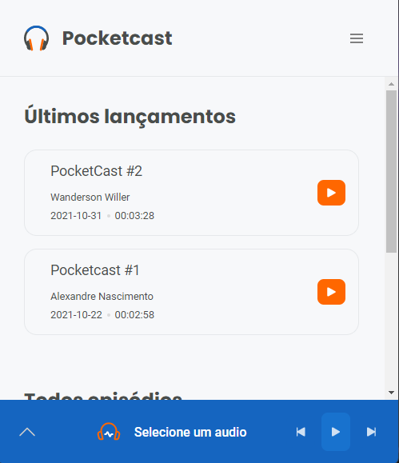

# PocketCast G❤️M

- Tela Login


- Tela Home


- Perfil de Usuário


- Completamente Responsivo



## <a href="https://pocketcastgs2m.netlify.app/">Link para a aplicação</a>
 

## Tecnologias
✔️ html

✔️ css

✔️ js

✔️ typescript

## Framework
✔️ React Js

## Banco de dados e hosting

✔️ Firebase = { firestore, autentication, storage }

✔️ Netlify = { Hosting }


# 💻 Instalação

## Clone o projeto

```https://github.com/Lucas-Eduardo-Goncalves/podcast_cm.git```

## Dependencias 

```
  @coreui/coreui: ^4.0.5,
  @coreui/react: ^4.0.0,
  @nandorojo/swr-firestore: ^0.16.0,
  @testing-library/jest-dom: ^5.11.4,
  @testing-library/react: ^11.1.0,
  @testing-library/user-event: ^12.1.10,
  bootstrap: ^5.1.3,
  date-fns: ^2.25.0,
  firebase: 8.6.8"
  polished: ^4.1.3,
  rc-slider: ^9.7.4,
  react: ^17.0.2,
  react-dom: ^17.0.2,
  react-hook-form: ^7.18.0,
  react-html-renderer: ^0.3.3,
  react-icons: ^4.3.1,
  react-modal: ^3.14.3,
  react-router-dom: ^5.3.0,
  react-scripts: 4.0.3,
  styled-components: ^5.3.3"
  typescript: ^4.1.2,
  web-vitals: ^1.0.1
```

## Dependencias de desenvolvimento 
```
  @types/jest: ^26.0.15,
  @types/node: ^12.0.0,
  @types/react: ^17.0.0,
  @types/react-dom: ^17.0.0,
  @types/react-modal: ^3.13.1,
  @types/react-router-dom: ^5.3.2,
  @types/styled-components: ^5.1.15,
  @types/typescript: ^2.0.0
```

## Rodar o projeto

- Você precisa instalar <a href="https://yarnpkg.com/">Yarn</a> para rodar o projeto 
- Entre na pasta do projeto
- Rode o comando `yarn` para adicionar as dependencias
- Rode `yarn start` para iniciar o servidor
